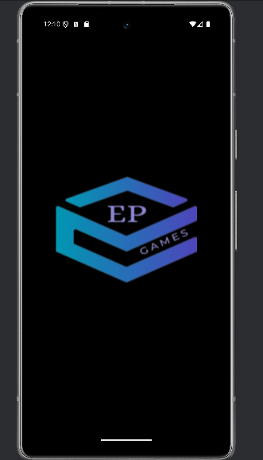
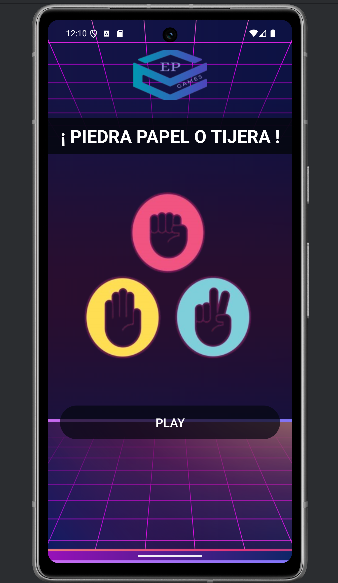
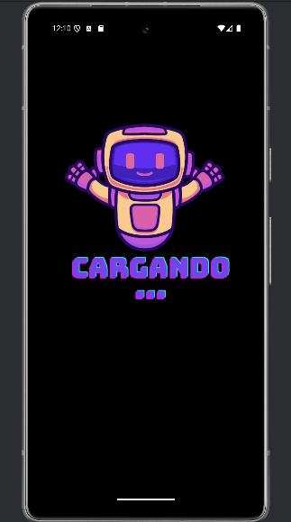
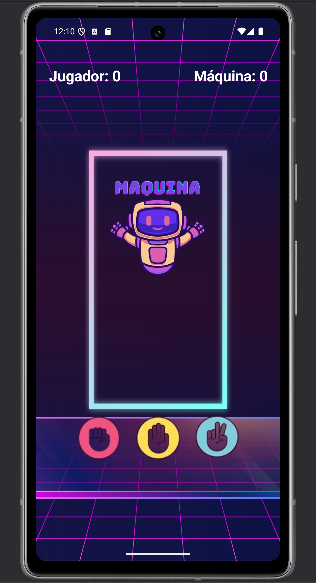
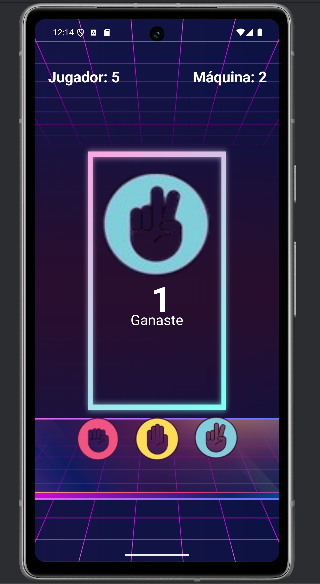

# Juego Piedra, Papel o Tijera ✂️

Un juego clásico de Piedra, Papel o Tijera desarrollado en Kotlin para Android. 
Este proyecto demuestra conceptos básicos de desarrollo de aplicaciones móviles, manejo de eventos, ciclos de vida de actividades y comunicación entre clases.

## 📋 Funcionalidades

- **Juego clásico**: Compite contra la máquina eligiendo entre Piedra, Papel o Tijera.
- **Sistema de puntuación**: Lleva un registro de los puntos del jugador y la máquina.
- **Interfaz visual**: La máquina muestra gráficamente su elección.
- **Temporizador**: Cuenta regresiva antes de mostrar el resultado.
- **Splash screens**: Introducción fluida al juego con pantallas de bienvenida.

## 📸 Vista Previa

    
    
    
    
    

## 📲 Descargar el APK

Puedes descargar el APK desde el siguiente enlace:  
[Descargar APK](https://github.com/Erick-Puni/Juego-Piedra-Papel-y.../tree/main/apk)

## ⚙️ Requisitos del Sistema

- **SDK mínimo**: 21 (Android 5.0 Lollipop)
- **SDK de compilación**: 35
- **Entorno de desarrollo**: Android Studio

## 🚀 Instalación y Ejecución

1. Clona este repositorio:
2. Abre el proyecto en Android Studio.
3. Sincroniza el proyecto con Gradle.
4. Ejecuta la aplicación en un emulador o dispositivo físico.
